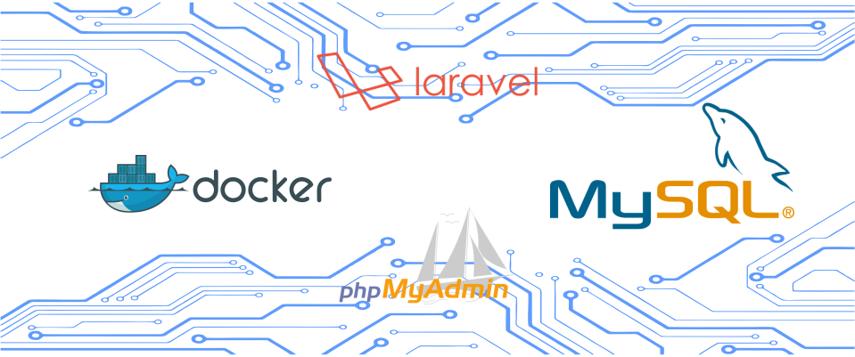

# Docker-Laravel-MySQL

## Downloading
`$ git clone https://github.com/jonysthil/test-docker-laravel-mysql-phpmyadmin.git`

## Installation

Enter the project folder in the initial container

`$ docker-compose up`

You go to the "sys" folder to download the composer packages.

`composer install --ignore-platform-reqs`
`php artisan key:generate`

## License

MIT
